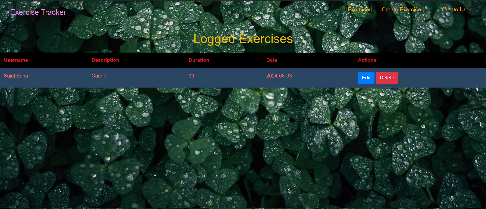

# Exercise Tracker Application

## Overview
The Exercise Tracker Application is a web-based application that allows users to track their exercises, including details such as the type of exercise, duration, and date. The application provides functionalities for creating, editing, and deleting exercise entries, offering a simple and intuitive interface for managing workout routines.

Features
Create New Exercises: Add new exercise entries with details like username, description, duration, and date.
Edit Exercises: Update existing exercise entries as needed.
Delete Exercises: Remove unwanted exercise entries from the list.
View Exercise List: Display a list of all recorded exercises.
Tech Stack
Frontend:

React
Bootstrap
Styled Components
Backend:

Node.js
Express.js
MongoDB
Getting Started
To get a local copy of the project up and running, follow these steps:

Prerequisites
Ensure you have the following installed:

Node.js
MongoDB (for the backend)
Clone the Repository
bash
Copy code
git clone https://github.com/your-username/exercise-tracker.git
cd exercise-tracker
Frontend Setup
Navigate to the client directory and install dependencies:

bash
Copy code
cd client
npm install
Backend Setup
Navigate to the server directory and install dependencies:

bash
Copy code
cd server
npm install
Running the Application
Start the Backend Server
bash
Copy code
cd server
npm start
Start the Frontend Server
bash
Copy code
cd client
npm start
Environment Variables
Create a .env file in the server directory and add your MongoDB connection string:

bash
Copy code
MONGO_URI=mongodb://localhost:27017/exercise-tracker
Deployment
Deploy the application using your preferred hosting service. For example, you can use Vercel for the frontend and Render for the backend.

Vercel Deployment
Push your code to GitHub.
Go to Vercel, create a new project, and import your repository.
Follow the prompts to deploy.
Render Deployment
Push your code to GitHub.
Go to Render, create a new web service, and link it to your GitHub repository.
Set up the build and start commands for your backend service.
Contributing
Fork the repository.
Create a feature branch (git checkout -b feature/YourFeature).
Commit your changes (git commit -am 'Add new feature').
Push to the branch (git push origin feature/YourFeature).
Create a new Pull Request.
License
This project is licensed under the MIT License - see the LICENSE file for details.

Acknowledgements
React
Node.js
Express.js
MongoDB
